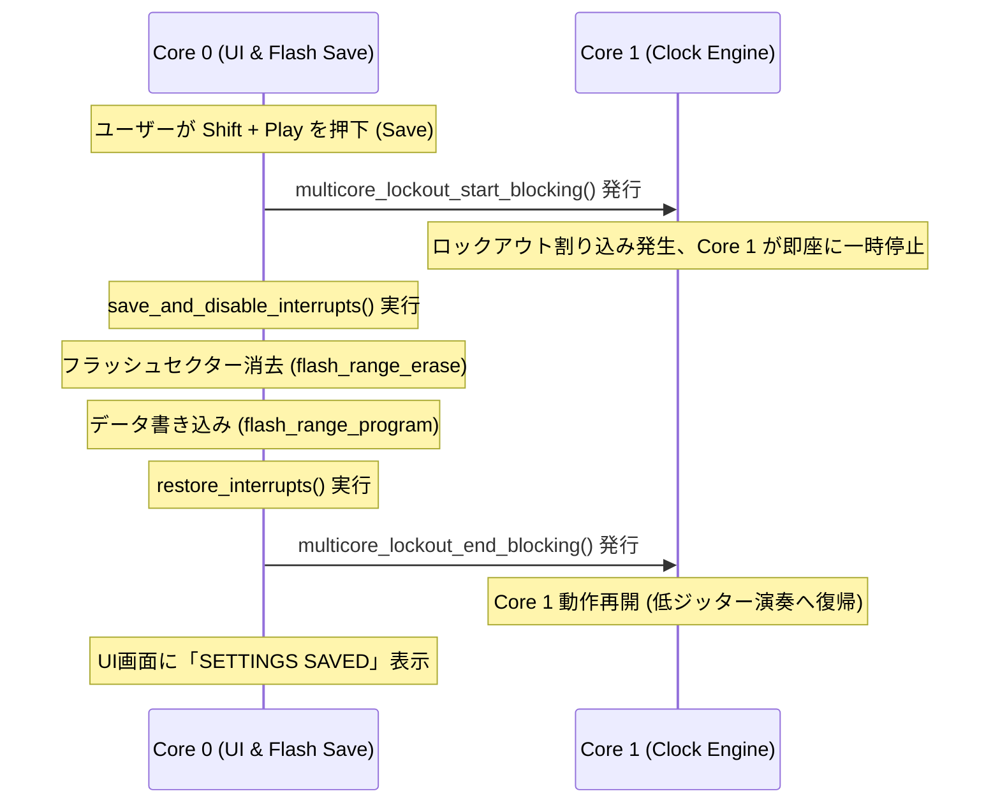

# Generative MIDI Sequencer - Software Architecture

本ドキュメントでは、Raspberry Pi Pico (RP2040) のデュアルコアアーキテクチャを活用し、画面描画の負荷に一切影響されない「極限まで低ジッターなリアルタイムMIDI演奏 & アナログクロック出力」を実現するソフトウェア設計について定義します。

---

## 1. デュアルコア・プロセッシングモデル (Dual-Core Division)

RP2040に搭載された2基の ARM Cortex-M0+ コアを完全に独立させ、それぞれ排他的なタスクを持たせています。

```mermaid
graph TD
    subgraph Core0 ["Core 0: UI & System Thread (Non-Realtime)"]
        A[InputManager] -->|9-key events| B[UI State / Grid Cursor]
        B -->|Volatile writes| C["shared_params (Spinlock Protected)"]
        D[StorageManager] -->|Flash Read/Write| C
        B -->|Render Grid| E[DisplayController]
        E -->|TFT SPI| F[3.2" ILI9341 Screen]
    end

    subgraph Core1 ["Core 1: Realtime Clock & Engine Thread (Low-Jitter)"]
        G[Precise Timer Loop] -->|Sleep-aligned| H[Bidi IPC check]
        C -->|Volatile reads| I[Track 1 - 4 Engines]
        I -->|Tick event| J[MidiHandler]
        J -->|UART TX| K[TRS-MIDI OUT]
        G -->|Trigger pulse| L[PIO I2S Driver]
        L -->|22.05kHz Callback| M[Analog Clock Sync OUT]
        I -->|Feedback step/hit| N[Volatile feedback variables]
    end

    N -->|Read State| E
```

### Core 0: ユーザーインターフェース & システム統括
非リアルタイムで、画面描画等の比較的重い処理を担当します。
*   **`InputManager` (キー制御)**: 16ms（約60Hz）の更新周期で 9つのキースイッチをGPIOスキャン。デバウンス処理を行い、単押し、長押し、Modifierキー（`LT` = Shift）の状態を判定してイベント化します。
*   **`DisplayController` (画面描画)**: SPI0バス（SCK: GP12, MOSI: GP19, CS: GP11）を介して、320x240ドットの液晶ディスプレイ ILI9341 を駆動。内蔵のピクセルフォントやカスタムアセットをメモリから読み出し、画面全幅ヘッダーやパラメータグリッド、ステッププレイヘッドを高速描画します。
*   **`StorageManager` (保存管理)**: フラッシュメモリ（QSPI）の最終セクター（`0xFFF000`）へダイレクトに設定データを退避／展開します。

### Core 1: リアルタイム・シーケンス & クロック同期
ハードウェアタイマーおよび高精度マイクロ秒ループを独占し、100%正確なタイミングでMIDIメッセージやトリガーパルスを放射します。
*   **Master Groove Clock Generator**: RP2040の `time_us_64()` ハードウェアタイマーを使用して、リアルタイム可変の `shared_bpm`（24 PPQN 周期）のマスタークロック信号を生成。スレッドプリエンプション（割り込みによる遅延）を防ぐため、Core 1自体は `tight_loop_contents()` を備えた極限まで緊密なポーリングループで待機します。
*   **Generative Sequence Coordinator (`Track 1`〜`Track 4`)**: 4系統のトラックインスタンスを保有。マスタークロックが進行する度に、共有メモリからそのトラックの最新パラメータをスピンロック経由で安全にローカルに反映（シャドウイング）させ、リズムとピッチの計算を実行します。
*   **`MidiHandler` (UART 送信)**: ボーレート 31,250 bps の標準シリアルMIDI信号を UART0 TX (GP0) からダイレクトに送信します。
*   **PIO I2S Analog Sync Pulse Controller**: 22.05 kHz の割り込みタイマーコールバック（`i2s_timer_callback`）から、PIO0のI2Sステレオ送信FIFOにサンプルデータ（+3.3Vゲートまたは0V）を連続供給。MIDIクロックと同期したアナログパルス信号を出力させます。

---

## 2. スピンロック付き共有メモリ通信モデル (Spinlock-Protected IPC)

Core 0 (UI/描画スレッド) と Core 1 (リアルタイムMIDIスレッド) 間のパラメータ通信には、RP2040のハードウェア・スピンロック (`spin_lock_t*`) による排他制御を採用しています。これにより、Core 0がパラメータを変更している最中に Core 1 がデータを取得しても、構造体データの「断片化（データティアリング）」や「不整合」が論理的に発生しない安全なアーキテクチャを実現しています。

```cpp
// Core 0 (UI) から Core 1 (Engine) への共有パラメータ構造体
struct TrackParams {
    volatile uint8_t length;       // ループステップ数 (1〜32)
    volatile uint8_t density;      // 発音パルス数 (0〜Length)
    volatile uint8_t shift;        // ユークリッドシフト (0〜Length)
    volatile uint8_t mutation;     // Turing Machine 変異確率 (0〜100%)
    volatile uint8_t root_note;    // 量子化ルート音 (MIDI値)
    volatile uint8_t scale_type;   // 量子化スケールID
    volatile uint8_t clock_divide; // クロック分周比
    volatile uint8_t jitter;       // マイクロタイミング・ジッター (0〜100%)
    volatile uint8_t gate;         // ゲート長さ (10〜100%)
    volatile bool is_muted;        // ミュート状態
};
extern TrackParams shared_params[4];

// Core 1 から Core 0 への状態フィードバック (描画同期用)
extern volatile uint8_t shared_current_step[4]; // 各トラックの再生中のカレントステップ
extern volatile bool shared_step_hit[4];        // トリガー発音ヒットの瞬間 (フラッシュ用)
extern volatile bool sequencer_playing;         // グローバル再生・停止フラグ
extern volatile uint16_t shared_bpm;            // リアルタイム可変BPM値
extern volatile uint32_t shared_master_ticks;   // 積算マスタークロック
```

### IPC動作 of データ安全性保証
1.  **ハードウェア・スピンロック (`spin_lock_t*`)**: Core 0 側でパラメータを変更する際、および Core 1 側でパラメータをローカルへシャドウイングコピーする際、スピンロック(`shared_params_lock`)をロックして操作をアトミックに行います。これにより、マルチバイトにまたがるパラメータデータが完璧に一貫して送受信されます。
2.  **ダブルバッファリング描画**: Core 0 の画面描画スレッド（`draw_ui_dashboard`）では、描画開始時にスピンロックを掛けて `shared_params` をローカルの `draw_params` バッファに一瞬で一括コピーし、その後ロックを解放して描画を行います。これにより、描画処理の遅延がシーケンサの再生ジッターに影響を与えることが絶対にありません。
3.  **アトミックライト／リード**: 単一の `shared_bpm` や `sequencer_playing` などのスカラー値は、CPU命令レベルで常に1サイクルで完結（アトミック）するため、不要なロックを取得せず高速に読み書きを行います。

---

## 3. クラス設計と詳細設計仕様 (C++ Class Reference)

C++17に準拠して設計された、自己完結的で堅牢な組み込み用クラス群です。

### 3.1. `EuclideanGenerator`
Bjorklundアルゴリズムを極限まで軽量化した **Bresenhamアルゴリズムベース** のO(1)計算手法を採用。一切の動的メモリ確保（malloc）や重い計算を行わず、高速にユークリッドトリガーの有無を判定します。
```cpp
class EuclideanGenerator {
public:
    EuclideanGenerator();
    // current_stepにおけるトリガー発生有無をBresenhamアルゴリズムで計算
    bool calculate_step(uint8_t current_step, uint8_t steps, uint8_t pulses, uint8_t shift);
};
```

### 3.2. `NoteGenerator` (Turing Machine)
16-bit擬似乱数シフトレジスタをシミュレートし、変異確率（Mutation）に基づいてビットを攪乱。生成されたCV（0〜255）を音楽的な音階へと変換します。
```cpp
class NoteGenerator {
private:
    uint16_t shift_register; // 初期値 0x9E37 (黄金比由来の定数)
public:
    NoteGenerator();
    void reset();
    // シフトレジスタの値を1ステップ進め、ランダムにビット反転させる
    uint8_t step(uint8_t mutation_rate);
    // CV値を指定されたルート・スケールに従って量子化する
    static uint8_t quantize(uint8_t raw_cv, uint8_t root_note, ScaleType scale);
};
```

### 3.3. `Track`
リズム生成とピッチ生成、および非同期にスケジュールされるマイクロタイミング・ジッターとゲート長の非同期イベント消滅（ノートオフ）のライフサイクルを制御するコアシーケンスクラスです。
```cpp
class Track {
private:
    uint8_t track_id;
    uint8_t midi_channel;
    EuclideanGenerator rhythm;
    NoteGenerator pitch;
    uint8_t current_step;
    uint8_t last_played_note;
    bool is_note_active;
    
    // シャドウパラメータ
    uint8_t length, density, shift, mutation_rate, root_note;
    ScaleType scale_type;
    uint8_t clock_divide;
    uint8_t jitter_rate; // 0 to 100
    uint8_t gate_rate;   // 10 to 100
    bool is_muted;

    // 非同期ノートスケジューラ
    uint64_t pending_note_on_time;
    uint8_t pending_note;
    bool has_pending_note;
    uint64_t pending_note_off_time;
    bool has_pending_note_off;

public:
    Track(uint8_t id, uint8_t channel);
    void reset();
    void set_params(uint8_t len, uint8_t dens, uint8_t shf, uint8_t mut, uint8_t root, ScaleType scale, uint8_t divide, uint8_t jit, uint8_t gt, bool muted);
    // クロックtickに合わせてシーケンスを進め、トリガー決定時にNoteOnを時間遅延込みでスケジュール
    bool tick(uint32_t master_tick, uint32_t bpm, MidiHandler& midi);
    // 非同期スケジューラ処理を回すため、Core 1 の超高速ポーリングループから連続呼び出しされる
    void update_scheduled_events(uint32_t bpm, MidiHandler& midi);
    // 現在の音階発音を強制的に停止 (NoteOff)
    void silence(MidiHandler& midi);
    uint8_t get_current_step() const { return current_step; }
};
```

### 3.4. `StorageManager`
RP2040のフラッシュ保護仕様に適合させた、極めて安全な不揮発性ストレージマネージャーです。
```cpp
class StorageManager {
private:
    static const uint32_t FLASH_SECTOR_SIZE = 4096;
    // 16MBフラッシュの最終4KBセクター
    static const uint32_t FLASH_TARGET_OFFSET = (16 * 1024 * 1024) - FLASH_SECTOR_SIZE; 
public:
    StorageManager();
    // shared_paramsの内容をフラッシュへ安全に書き出し
    void save(const TrackParams params[4]);
    // フラッシュからデータをロードし、マジックナンバーチェックを行って適用
    bool load(TrackParams params[4]);
};
```

---

## 4. XIPキャッシュクラッシュを回避するマルチコア・ロックアウト (Multicore Lockout)

RP2040は、実行中のコードプログラムをQSPIフラッシュメモリから直接読み出して実行する（XIP: Execute In Place）方式をとっています。フラッシュの消去・書き込みを行っている瞬間は、CPUからフラッシュを読み出すことができず、このタイミングで別コア（Core 1）がフラッシュへアクセスすると、**XIPキャッシュ不在によるCPUクラッシュ (HardFault)** が即座に発生します。

本プロジェクトでは、スリープによる曖昧な待機ではなく、Pico SDK標準の **「マルチコア・ロックアウト (Multicore Lockout) API」** を導入し、100%安全かつ堅牢なフラッシュ保存処理を実現しています。



### ロックアウト動作プロセスの詳細
1.  **ロックアウトの始動**: Core 1 は起動時（`core1_entry()`）に `multicore_lockout_victim_init()` を呼び出して、ロックアウト要求の受付リスナー（FIFOハンドラ割り込み）を事前に登録しておきます。
2.  **Core 1 の完全強制停止**: Core 0 がフラッシュ保存の処理に入る直前に `multicore_lockout_start_blocking()` を呼び出します。これにより、Core 1 の実行はハードウェアレベルで即座に一時停止（ロックアウト状態）となり、フラッシュ上のあらゆる命令コードや読み込み領域へのアクセスが一切遮断されます。
3.  **割り込みの完全な禁止**: Core 0 は `save_and_disable_interrupts()` を呼び出し、Core 0 自身がフラッシュ操作中に他の割り込みルーチンにジャンプするのを防ぎます。
4.  **フラッシュ操作の安全実行**: この完全防護された状態で、フラッシュ消去（`flash_range_erase`）および保存書き込み（`flash_range_program`）が実行されます。
5.  **ロックアウトの解除と再開**: 保存完了後、Core 0 が `multicore_lockout_end_blocking()` を呼び出すことで Core 1 は停止した場所から何事もなかったかのように安全に動作を再開します。これにより、クラッシュが論理的かつ物理的に完全に防止されます。

---

## 5. UI カーソルFXシステム (Premium Cursor FX System)

ユーザーの選定位置を即座に伝える「選択セルの表示」には、単純な色反転（白バックグラウンド化）ではなく、ゲームUIライクな **「シューティングフォーカス・コーナーマーカー」** および **「アナロググリッチ移動エフェクト」** を導入しています。

### 5.1. 平常時（選択セル）
*   選択セルの背景反転処理を廃止し、セルの背景を本来の黒（Mute時はダークグレー）に据え置きます。
*   セルの四隅（2ピクセル外側の領域）に、**三角L字型（コーナーマーカー）**を常時表示します。
*   マーカーの長さは縦横4ピクセル、カラーはネオンシアン（`COLOR_CYAN`）を採用してサイバーパンク/プレミアムテクノの雰囲気を引き立てます。

### 5.2. 移動時（230ms アナロググリッチトランジション）
十字キー入力によるカーソル移動が検知された瞬間、以下のタイムスケジュールに沿って激しい2段階のアナロググリッチ背景フラッシュ & X軸ジッターが発火します：

| フレーム | 経過時間 (ms) | セル表示状態 | X軸ズレ幅 |
| :--- | :--- | :--- | :--- |
| **Frame 0** | 0ms 〜 70ms | マゼンタ背景 (`COLOR_MAGENTA`)、テキスト黒色 | `-3px` (左に急ジャンプ) |
| **Frame 1** | 70ms 〜 120ms | シアン背景 (`COLOR_CYAN`)、テキスト黒色 | `+2px` (右に跳ね返り) |
| **Frame 2** | 120ms 〜 180ms | マゼンタ背景 (`COLOR_MAGENTA`)、テキスト黒色 | `-1px` (左に微ブレ) |
| **Frame 3** | 180ms 〜 230ms | シアン背景 (`COLOR_CYAN`)、テキスト黒色 | `0px` (元の位置に収束) |
| **Frame 4** | 230ms 〜 350ms | 黒/通常背景に戻り、コーナーマーカーが `scale(1.6)` から `scale(1.0)` へ高速にスナップイン（吸い込み収束アニメーション） | `0px` (静止) |

*   値変更操作（A/Bボタン押下）ではこのグリッチはトリガーされず、コーナーマーカーの定常表示のみが維持されます。
*   グリッチアニメーション発生中の350msの窓期間中は、Core 0 のメインループ内で画面の `force_redraw` フラグを強制的に `true` に保ち、液晶ディスプレイ（ILI9341）への描画を毎フレーム最高レート（約60Hz）で連続走査することで、極めて滑らかなトランジションを保証します。
