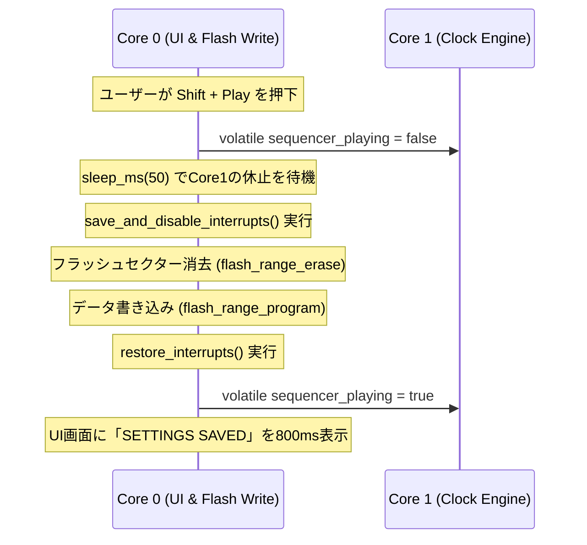

# Generative MIDI Sequencer - Software Architecture

本ドキュメントでは、Raspberry Pi Pico (RP2040) のデュアルコアアーキテクチャを活用し、画面描画の負荷に一切影響されない「極限まで低ジッターなリアルタイムMIDI演奏 & アナログクロック出力」を実現するソフトウェア設計について定義します。

---

## 1. デュアルコア・プロセッシングモデル (Dual-Core Division)

RP2040に搭載された2基の ARM Cortex-M0+ コアを完全に独立させ、それぞれ排他的なタスクを持たせています。

```mermaid
graph TD
    subgraph Core0 ["Core 0: UI & System Thread (Non-Realtime)"]
        A[InputManager] -->|9-key events| B[UI State / Grid Cursor]
        B -->|Volatile writes| C[shared_params]
        D[StorageManager] -->|Flash Read/Write| C
        B -->|Render Grid| E[DisplayController]
        E -->|TFT SPI| F[3.2" ILI9341 Screen]
    end

    subgraph Core1 ["Core 1: Realtime Clock & Engine Thread (Low-Jitter)"]
        G[Precise Timer Loop] -->|Sleep-aligned| H[Bidi IPC check]
        C -->|Volatile reads| I[Track 1 - 4 Engines]
        I -->|Tick event| J[MidiHandler]
        J -->|UART TX| K[TRS-MIDI OUT]
        G -->|Trigger pulse| L[PIO I2S Driver]
        L -->|22.05kHz Callback| M[Analog Clock Sync OUT]
        I -->|Feedback step/hit| N[Volatile feedback variables]
    end

    N -->|Read State| E
```

### Core 0: ユーザーインターフェース & システム統括
非リアルタイムで、画面描画等の比較的重い処理を担当します。
*   **`InputManager` (キー制御)**: 16ms（約60Hz）の更新周期で 9つのキースイッチをGPIOスキャン。デバウンス処理を行い、単押し、長押し、Modifierキー（`LT` = Shift）の状態を判定してイベント化します。
*   **`DisplayController` (画面描画)**: SPI0バス（SCK: GP12, MOSI: GP19, CS: GP11）を介して、320x240ドットの液晶ディスプレイ ILI9341 を駆動。内蔵のピクセルフォントやカスタムアセットをメモリから読み出し、画面全幅ヘッダーやパラメータグリッド、ステッププレイヘッドを高速描画します。
*   **`StorageManager` (保存管理)**: フラッシュメモリ（QSPI）の最終セクター（`0xFFF000`）へダイレクトに設定データを退避／展開します。

### Core 1: リアルタイム・シーケンス & クロック同期
ハードウェアタイマーおよび高精度マイクロ秒ループを独占し、100%正確なタイミングでMIDIメッセージやトリガーパルスを放射します。
*   **Master Clock Generator**: RP2040の `time_us_64()` ハードウェアタイマーを使用して、120 BPM（24 PPQN = 20.83ms周期）のマスタークロック信号を生成。スレッドプリエンプション（割り込みによる遅延）を防ぐため、Core 1自体は `tight_loop_contents()` を備えた極限まで緊密なポーリングループで待機します。
*   **Generative Sequence Coordinator (`Track 1`〜`Track 4`)**: 4系統のトラックインスタンスを保有。マスタークロックが進行する度に、共有メモリからそのトラックの最新パラメータを即座にローカルに反映（シャドウイング）させ、リズムとピッチの計算を実行します。
*   **`MidiHandler` (UART 送信)**: ボーレート 31,250 bps の標準シリアルMIDI信号を UART0 TX (GP0) からダイレクトに送信します。
*   **PIO I2S Analog Sync Pulse Controller**: 22.05 kHz の割り込みタイマーコールバック（`i2s_timer_callback`）から、PIO0のI2Sステレオ送信FIFOにサンプルデータ（+3.3Vゲートまたは0V）を連続供給。MIDIクロックと同期したアナログパルス信号を出力させます。

---

## 2. ロックフリー・コア間通信 (Inter-Core IPC)

リアルタイムスレッド（Core 1）がUI描画（Core 0）によるミューテックスのロック解放待ちなどでブロックされることを避けるため、スピンロックやセマフォなどの排他制御を一切使用しない **「ロックフリー揮発性共有メモリモデル (Lock-Free Volatile Shared Memory)」** を採用しています。

```cpp
// Core 0 (UI) から Core 1 (Engine) への単方向パラメータ伝達
struct TrackParams {
    volatile uint8_t length;       // ループステップ数 (1〜32)
    volatile uint8_t density;      // 発音パルス数 (0〜Length)
    volatile uint8_t shift;        // ユークリッドシフト (0〜Length)
    volatile uint8_t mutation;     // Turing Machine 変異確率 (0〜100%)
    volatile uint8_t root_note;    // 量子化ルート音 (MIDI値)
    volatile uint8_t scale_type;   // 量子化スケールID
    volatile uint8_t clock_divide; // クロック分周比
    volatile bool is_muted;        // ミュート状態
};
extern TrackParams shared_params[4];

// Core 1 から Core 0 への状態フィードバック (描画同期用)
extern volatile uint8_t shared_current_step[4]; // 各トラックの再生中のカレントステップ
extern volatile bool shared_step_hit[4];        // トリガー発音ヒットの瞬間 (フラッシュ用)
extern volatile bool sequencer_playing;         // グローバル再生・停止フラグ
extern volatile uint32_t shared_master_ticks;   // 積算マスタークロック
```

### IPC動作のデータ安全性保証
1.  **アトミックライト／リード**: RP2040 (Cortex-M0+) のバス幅である32ビット以下の整数データ（`uint8_t`, `bool`等）のみを共有変数として使用しているため、メモリの読み書き操作はCPU命令レベルで常に1サイクル（アトミック）で完結します。したがって、部分書き換えによるデータの破損は論理的に発生しません。
2.  **揮発性修飾（`volatile`）**: コンパイラの最適化によるレジスタキャッシュを強制的にバイパスし、常に実RAMへの読み出し・書き込みを強制します。

---

## 3. クラス設計と詳細設計仕様 (C++ Class Reference)

C++17に準拠して設計された、自己完結的で堅牢な組み込み用クラス群です。

### 3.1. `EuclideanGenerator`
Bjorklundアルゴリズムを極限まで軽量化した **Bresenhamアルゴリズムベース** のO(1)計算手法を採用。一切の動的メモリ確保（malloc）や重い計算を行わず、高速にユークリッドトリガーの有無を判定します。
```cpp
class EuclideanGenerator {
public:
    EuclideanGenerator();
    // current_stepにおけるトリガー発生有無をBresenhamアルゴリズムで計算
    bool calculate_step(uint8_t current_step, uint8_t steps, uint8_t pulses, uint8_t shift);
};
```

### 3.2. `NoteGenerator` (Turing Machine)
16-bit擬似乱数シフトレジスタをシミュレートし、変異確率（Mutation）に基づいてビットを攪乱。生成されたCV（0〜255）を音楽的な音階へと変換します。
```cpp
class NoteGenerator {
private:
    uint16_t shift_register; // 初期値 0x9E37 (黄金比由来の定数)
public:
    NoteGenerator();
    void reset();
    // シフトレジスタの値を1ステップ進め、ランダムにビット反転させる
    uint8_t step(uint8_t mutation_rate);
    // CV値を指定されたルート・スケールに従って量子化する
    static uint8_t quantize(uint8_t raw_cv, uint8_t root_note, ScaleType scale);
};
```

### 3.3. `Track`
リズム生成とピッチ生成、およびMIDIノートオフのライフサイクルを制御するコアエンジンクラスです。
```cpp
class Track {
private:
    uint8_t track_id;
    uint8_t midi_channel;
    EuclideanGenerator rhythm;
    NoteGenerator pitch;
    uint8_t current_step;
    uint8_t last_played_note;
    bool is_note_active;
    // シャドウパラメータ
    uint8_t length, density, shift, mutation_rate, root_note;
    ScaleType scale_type;
    uint8_t clock_divide;
    bool is_muted;
public:
    Track(uint8_t id, uint8_t channel);
    void reset();
    void set_params(uint8_t len, uint8_t dens, uint8_t shf, uint8_t mut, uint8_t root, ScaleType scale, uint8_t divide, bool muted);
    // クロックtickに合わせて進み、トリガーが発生した場合はMIDI NoteOnを出力
    bool tick(uint32_t master_tick, MidiHandler& midi);
    // 現在の音階発音を強制的に停止 (NoteOff)
    void silence(MidiHandler& midi);
    uint8_t get_current_step() const { return current_step; }
};
```

### 3.4. `StorageManager`
RP2040のフラッシュ保護仕様に適合させた、極めて安全な不揮発性ストレージマネージャーです。
```cpp
class StorageManager {
private:
    static const uint32_t FLASH_SECTOR_SIZE = 4096;
    // 16MBフラッシュの最終4KBセクター
    static const uint32_t FLASH_TARGET_OFFSET = (16 * 1024 * 1024) - FLASH_SECTOR_SIZE; 
public:
    StorageManager();
    // shared_paramsの内容をフラッシュへ安全に書き出し
    void save(const TrackParams params[4]);
    // フラッシュからデータをロードし、マジックナンバーチェックを行って適用
    bool load(TrackParams params[4]);
};
```

---

## 4. XIPキャッシュクラッシュを回避するフラッシュセーブシーケンス

RP2040は、実行中のコードプログラムをQSPIフラッシュメモリから直接読み出して実行する（XIP: Execute In Place）方式をとっています。フラッシュの消去・書き込みを行っている瞬間は、CPUからフラッシュを読み出すことができず、このタイミングで割り込み処理等が走ると **XIPキャッシュ不在によるCPUクラッシュ (HardFault)** が即座に発生します。

本プロジェクトでは、これを回避するため以下の厳密なフラッシュセーブシーケンスを実装しています。



1.  **Core 1の休止**: Core 0が `sequencer_playing` を `false` に設定し、Core 1を `tight_loop_contents()` による完全なアイドルポーリング状態に強制移行させます。
2.  **割り込みの完全な禁止**: Core 0は `save_and_disable_interrupts()` を呼び出し、ローカルのハードウェア割り込みやSystickタイマーを完全に無効化します。
3.  **フラッシュ操作の安全実行**: この状態において、安全にセクター消去（`flash_range_erase`）およびデータ保存（`flash_range_program`）を実施します。
4.  **復帰**: 割り込みを元の状態へ復帰させ、`sequencer_playing` を元の状態に戻してCore 1のシーケンス演奏を安全に再開します。
